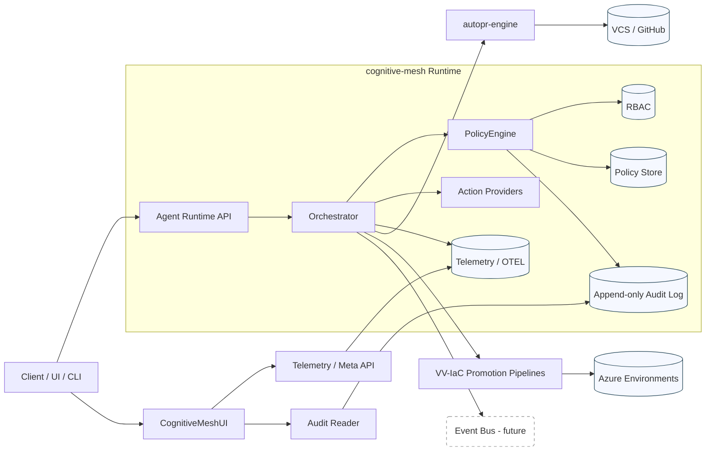
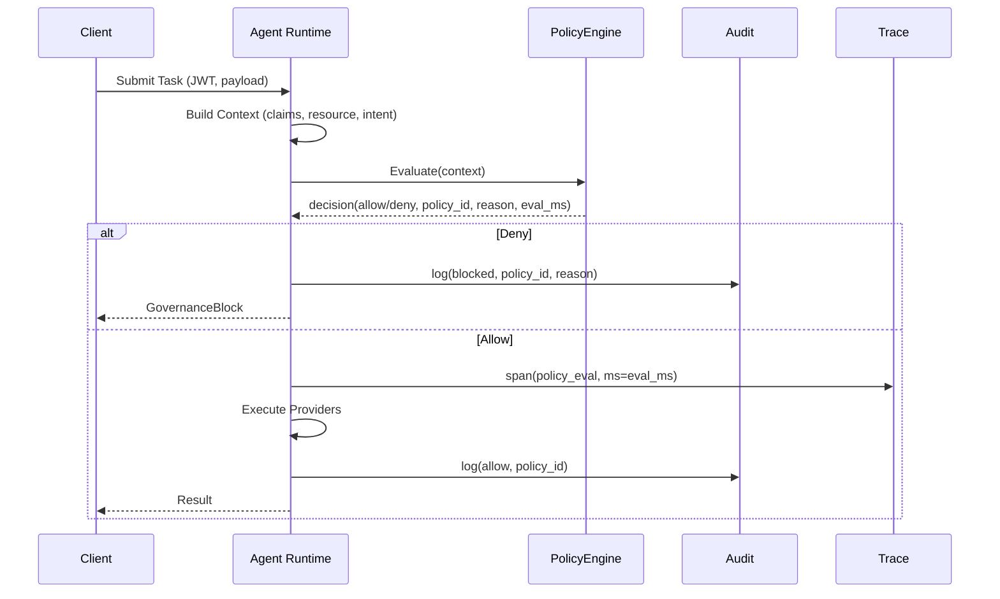

# Cognitive Mesh Platform Architecture
Jurie “JustAGhosT” Smit — Agentic Platform & Governance Architect

## 1. Purpose
Consolidated architecture reference for the governed agent platform: agent runtime → policy spine → Azure infrastructure guardrails → AI PR automation → telemetry UI. Used for: onboarding, extension, threat review, performance tuning.

## 2. Scope
In-scope:
- Runtime orchestration (cognitive-mesh)
- Governance (policy evaluation, RBAC, audit, traceability)
- PR automation (autopr-engine)
- Infra as Code + promotion pipeline (vv-iac)
- UI surface & telemetry (CognitiveMeshUI)
- Observability, compliance posture, extension seams

Out-of-scope (this revision):
- Business-domain specific agents
- RAG corpus build/deployment specifics
- Advanced cost modeling

## 3. Core Objectives
- Enforce explicit policy before side-effects (governed determinism)
- Reduce review and deployment latency without eroding safety
- Provide auditable lineage (who/what/why) for every automated decision
- Minimize integration glue by owning vertical seams
- Make extension (new capability/provider) bounded + observable

## 4. Architectural Principles
- Governance First: Policy decision precedes execution (no “post-hoc” denial).
- Explicit Surfaces: Every extension point has an interface + contract doc.
- Deterministic Audit Shape: Stable schema versioned; append-only.
- Lean State: Prefer ephemeral evaluation contexts over persistent coupling.
- Fail Closed: On evaluator ambiguity or policy engine errors → deny + emit audit.
- Trace Everywhere: Every governance-relevant path emits structured trace spans.
- Measured Latency Budgets: Policy eval p95 target ≤ 50ms initial; stretch 30ms.
- Incremental Hardening: Start permissive with logged advisories → graduate to enforce.

## 5. High-Level View

## 6. Component Inventory

### 6.1 cognitive-mesh (Agent / LLM Orchestration)
Responsibilities:
- Accept task / workflow requests
- Construct evaluation context (identity, intent, inputs)
- Invoke policy engine
- Coordinate tool / provider calls
- Emit audit + telemetry
Key Modules:
- Orchestrator
- Provider Registry
- Policy Client Adapter
- Identity & RBAC Adapter
- Tracing / Metrics Middleware
Extension Points:
- Action Provider (interface + capability manifest)
- Policy Hook (pre/post evaluation metrics decorators)
- Context Enricher (adds claims / derived attributes)
Failure Modes:
- Policy Timeout → Fail closed
- Provider Error → Retry (bounded) → escalate or partial result emit
- Identity Unresolved → Immediate deny

### 6.2 Policy Engine
Functions:
- Load & cache compiled policies (versioned)
- Evaluate: (workflow_id, subject, resource, action, context claims)
- Return structured decision (allow | deny | advisory) + reason + policy_id + eval_ms
Internals:
- Policy DSL or OPA/Rego (TBD actual implementation)
- Deterministic ordering of rule evaluation
- Hash fingerprint of policy set for audit correlation
Data:
- Policy store (git-backed or blob; hashed deploy artifact)
- RBAC roles mapping (role → permissions)
Latency Targets:
- Cold load ≤ 500ms (background warming)
- Warm p95 ≤ 50ms (stretch 30ms)
Observability:
- Decision trace span (attributes: policy_id, effect, eval_ms, rule_path)

### 6.3 RBAC / Identity
- Claims resolution from token (OIDC/JWT) or service principal
- Role → permission expansion
- Denormalized claim object passed into policy engine
- Future: Attribute-based access overlays (ABAC) for environment tier or data class

### 6.4 Audit Subsystem
Schema (stable, versioned):
- id
- timestamp (UTC ISO)
- actor (id, type)
- workflow_id
- action
- resource
- policy_id
- decision (allow|deny|advisory|error)
- reason_code / message
- context_fingerprint (hash of selective fields)
- correlation_id (trace root)
Storage:
- Append-only log (e.g., durable table or event stream)
- Partition strategy: date + policy_id
Access:
- Read API (paged, filter by actor/policy/time)
Integrity Option (future):
- Periodic Merkle root commit for non-repudiation

### 6.5 autopr-engine
Purpose:
- Analyze pull requests (semantic + heuristic factors)
- Provide risk score + review hints
Flow:
- Fetch diff → tokenize → classify change types (config, infra, library, logic)
- Semantic weighting (e.g., cross-file coupling)
- Optional LLM summarization for complex diffs
- Output: structured review artifact + suggestions
Governance Tie-In:
- Policies may deny merge if risk > threshold without human review
Extensibility:
- Analyzer plugin interface
- Weighting strategy injection

### 6.6 vv-iac (Infrastructure as Code & Promotion)
Focus:
- Bicep/Terraform definitions
- What-if pre-merge validation
- Policy chain (cost, tagging, security baseline)
Pipeline Stages:
1. Lint / Format
2. Static Policy (OPA/Custom)
3. What-if Plan
4. Drift Check
5. Promotion Gate (env-specific)
6. Apply
Governance:
- Each stage emits evaluation record linked to policy engine decision id
Failure Modes:
- Drift detected → block promote, require reconcile PR
- Cost anomaly (delta threshold) → escalate

### 6.7 CognitiveMeshUI
Responsibilities:
- Task submission UI
- Audit viewer
- Policy decision explorer (future)
- Telemetry dashboards (latency, decision distribution)
Design:
- Token-driven component system
- Storybook coverage for base components
Data Sources:
- Read-only audit API
- Metrics/trace aggregator
- Policy metadata endpoint

### 6.8 Telemetry & Observability
Stack:
- OpenTelemetry tracing
- Metrics: policy_eval_ms_histogram, decision_count{effect=...}, provider_latency
- Logs: structured JSON, correlation_id propagation
Dashboards:
- Policy latency p50/p95/p99
- Decision distribution (allow/deny/advisory)
- PR risk score histogram
- IaC pipeline duration by stage

### 6.9 Shared Libraries
- Contracts (DTOs for decision, audit event)
- Error types (GovernanceBlock, ProviderTimeout, PolicyEvaluationError)
- Telemetry instrumentation wrappers
- Serialization (canonical JSON rules)

## 7. Deployment & Environments
Environments:
- dev (rapid iteration, advisory-only policies)
- staging (enforced except experimental)
- prod (strict enforcement, metrics SLO tracking)
Promotion:
- GitHub Actions orchestrated
- Immutable artifacts (container digests + policy bundle hash)
- Policy bundle & runtime must version-lock (compat matrix)

## 8. Data Flows

### 8.1 Task Execution Flow
1. Client calls /task with token
2. Identity claims resolved → context enriched
3. Policy Engine evaluate(context)
4. If deny → emit audit (deny) → return 403
5. If allow → orchestrate provider calls (each traced)
6. Aggregate result → audit (allow) → respond

### 8.2 PR Analysis Flow
1. CI trigger → autopr-engine container
2. Fetch diff + metadata
3. Analyzer pipeline (semantic, heuristic, optional LLM)
4. Generate structured review + risk score
5. Optionally call policy engine (e.g., risk gating)
6. Post review comments

### 8.3 IaC Promotion Flow
1. PR open → plan (what-if)
2. Policy evaluation (cost/security)
3. Merge → pipeline promote staging
4. Drift compare → if clean → apply
5. Policy evaluation (post-apply conformance)
6. Audit & metrics emit

## 9. Sequence (Policy-Governed Execution)

## 10. Policy Evaluation Lifecycle
Phases:
- Context Assembly (claims + resource classification)
- Static Policy Set Selection (by environment / version)
- Rule Matching (ordered; short-circuit allowed)
- Decision Consolidation (most restrictive wins unless explicit override)
- Reason Mapping (human readable + code)
- Emission (decision object + telemetry + optional advisory)
Versioning:
- Policy bundle hash (SHA256) recorded in audit
- Backward compatibility: deprecate rule → shadow advisory → enforce after N cycles

## 11. Extension Points (Contracts)
| Extension | Interface Elements | Registration | Observability |
|-----------|-------------------|-------------|---------------|
| Action Provider | execute(context), capabilities(), timeout_s | Provider registry config | provider_latency, provider_errors |
| Analyzer Plugin (PR) | analyze(diff_ctx) → findings[] | Plugin manifest | analyzer_duration |
| Policy Hook | before(context), after(decision) | Policy engine config | hook_latency |
| Context Enricher | enrich(base_context) → extended | Enricher chain | enrich_duration |

## 12. Security & Compliance Posture
- AuthN: OIDC (JWT) tokens; service principals for automation
- AuthZ: RBAC + policy overlays
- Secrets: Managed (KV); rotated under pipeline
- Network: Principle of least privilege (future: Private endpoints)
- Supply Chain: Pin container SHAs; Snyk/Dependabot scanning
- Audit Integrity: Append-only; future periodic hash notarization
- Data Minimization: No sensitive payload persisted in audit (only hashed reference if needed)

## 13. Performance & Scaling
- Policy Engine: In-memory compiled rules; periodic reload if bundle hash changes
- Horizontal Scaling: Stateless orchestrator pods; sticky not required
- Backpressure: Queue (future) for burst tasks; policy still synchronous
- Caching: Provider-specific (e.g., metadata lookups) with TTL + invalidation
- Metrics Targets (initial):
  - Policy eval p95 ≤ 50ms
  - PR analysis median ≤ 90s for large diffs
  - IaC plan + policy composite ≤ 5m for standard stack

## 14. Failure Modes & Mitigations
| Failure | Impact | Mitigation |
|---------|--------|-----------|
| Policy engine timeout | Blocks task | Fail closed + audit reason=timeout |
| Provider cascade failure | Task partial/incomplete | Circuit breaker + degrade mode |
| Drift detection false positive | Promotion delay | Secondary confirm pass |
| Telemetry backend outage | Lost metrics | Local buffer + drop non-critical spans |
| Analyzer plugin panic | Incomplete review | Sandbox plugin; skip & flag |
