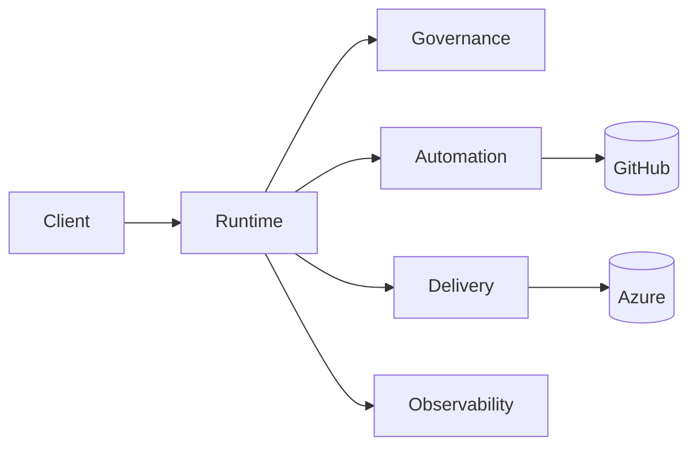

# Jurie "JustAGhosT" Smit  
Agentic Platform & Governance Architect • Cognitive Mesh / Policy Spine / AI PR Automation  
Outcome: Safer, faster iteration (governed, observable, low-friction delivery)


## Platform Slice (Code > Claims)
- cognitive-mesh: Agent + LLM orchestration, RBAC, audit, policy seams (RAG-ready).
- CognitiveMeshUI: Token-driven React/Next.js surface + interaction telemetry.
- autopr-engine: AI-in-loop PR heuristics + semantic diff weighting (review compression).
- vv-iac: Azure Bicep/Terraform + what-if + policy chain (cost/compliance guard).
- crisis-unleashed-app: FastAPI + React clean arch teaching baseline.
- home-lab-setup: Reproducible Azure homelab (P2S VPN, cert lifecycle, monitoring).

## Active Work
- Policy eval latency reduction.
- Deterministic audit event schema (forward-compatible).
- autopr-engine FP reduction via semantic weighting calibration.
- IaC promotion condensation: pre-merge what-if + policy collapse.

## Skim These First
- cognitive-mesh /governance → policy_evaluation entrypoint
- autopr-engine /core → review_strategy
- vv-iac /pipelines → gated promotion pattern

## Representative Governance Check
```python
decision = policy_engine.evaluate(workflow_id, context)
if not decision.allow:
    audit.log(
        workflow_id,
        blocked=True,
        policy=decision.policy_id,
        reason=decision.reason
    )
    raise GovernanceBlock(decision.reason)

trace.record(
    workflow_id,
    policy=decision.policy_id,
    eval_ms=decision.eval_ms
)
```

## Architecture (Summary)
<!-- ARCHITECTURE:START -->
Mermaid exec summary (auto-sync candidate):



Full spec → ARCHITECTURE.md  
<!-- ARCHITECTURE:END -->

## Quick Nav
[Agent Core](https://github.com/JustAGhosT/cognitive-mesh) • 
[PR Automation](https://github.com/JustAGhosT/autopr-engine) • 
[Infra Guardrails](https://github.com/JustAGhosT/vv-iac) • 
[UI Surface](https://github.com/JustAGhosT/CognitiveMeshUI)

## Stack & Practices
Azure • Bicep/Terraform • .NET • Python/FastAPI • TypeScript/Next.js • REST/gRPC • Event-driven • OpenTelemetry • Policy-as-Code • GitHub Actions • Hex / selective DDD

## Contact
Email: smit.jurie@gmail.com • LinkedIn: https://www.linkedin.com/in/juriesmit
